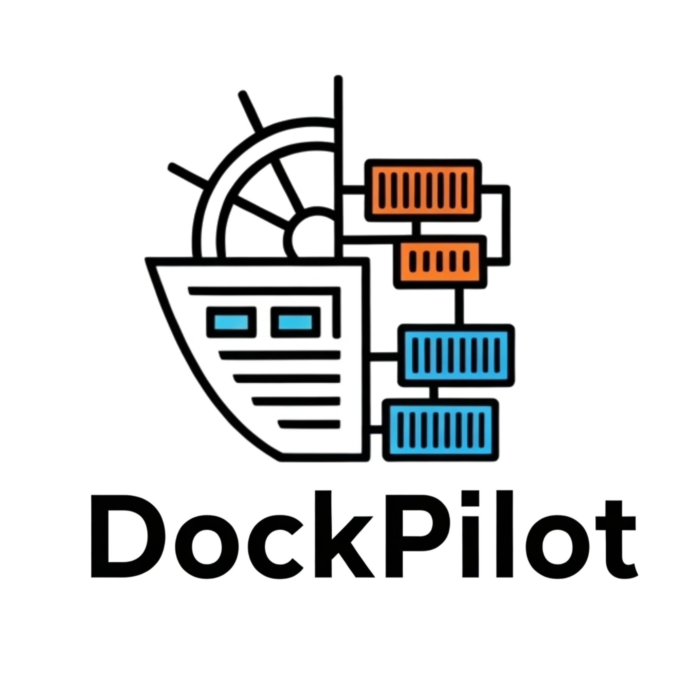
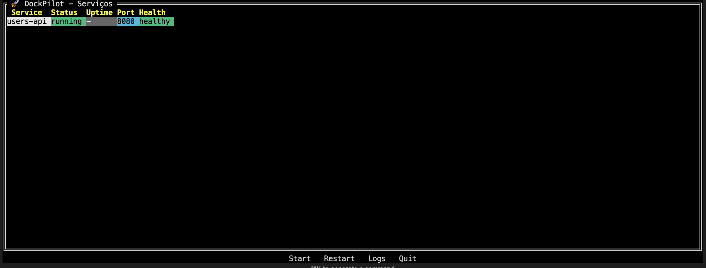
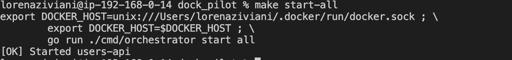
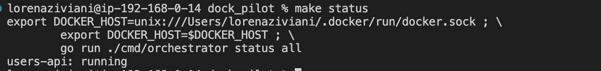
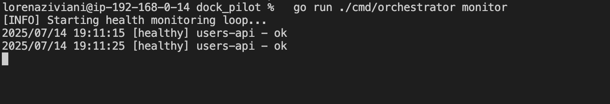
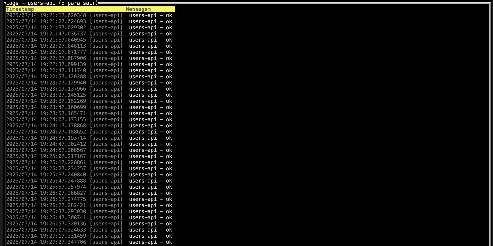
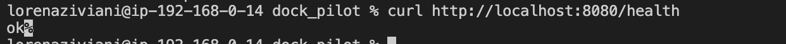
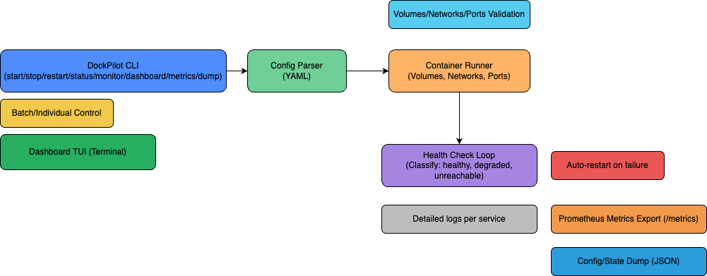

# 🚢 DockPilot - Orquestrador Local de Microsserviços com Dashboard TUI

<div align="center">


<div data-badges>
  
  
  
</div>
</div>

O **DockPilot** é um orquestrador leve para microsserviços locais, desenvolvido em Go, com deploy automatizado, health checks, painel de controle, dashboard interativo no terminal (TUI) e suporte a métricas/logs para análise e debugging.

✔️ **Orquestração de containers Docker via Go**

✔️ **Dashboard TUI interativo com status, health, logs e atalhos**

✔️ **Health check automático e autocorreção de serviços**

✔️ **Exportação de métricas Prometheus e logs estruturados**

✔️ **Configuração simples via YAML e ambiente Docker-friendly**

---

## 🖥️ Como rodar este projeto

### Requisitos:

- [Go 1.20+](https://golang.org/doc/install)
- [Docker Desktop](https://docs.docker.com/get-docker/)

### Execução:

1. Clone este repositório:
   ```sh
   git clone https://github.com/lorenaziviani/dock_pilot.git
   cd dock_pilot
   ```
2. Configure variáveis de ambiente (opcional):
   ```sh
   cp .env.example .env
   # Edite .env conforme necessário
   ```
3. Edite o `config.yaml` para definir seus serviços:
   ```yaml
   services:
     - name: users-api
       image: users-api:latest
       port: 8080
       healthcheck: /health
       ports:
         - 8080:8080
   ```
4. Suba um serviço de exemplo (mock):
   ```sh
   docker build -t users-api:latest ./users-api
   ```
5. Execute o dashboard TUI:
   ```sh
   make run
   # ou
   DOCKER_HOST=unix:///Users/$(whoami)/.docker/run/docker.sock go run ./cmd/orchestrator/main.go dashboard
   ```
6. Execute outros comandos disponíveis:
   ```sh
   go run ./cmd/orchestrator/main.go start all
   go run ./cmd/orchestrator/main.go status all
   go run ./cmd/orchestrator/main.go monitor
   go run ./cmd/orchestrator/main.go metrics
   go run ./cmd/orchestrator/main.go dump
   ```

---

## 📸 Prints do Projeto

### Dashboard TUI



### Subindo serviços



### Status dos containers



### Monitoramento e autocorreção



### Logs estruturados



### Exemplo de health check manual

```sh
curl http://localhost:8080/health
```



---

## 📝 Principais Features

- **Dashboard TUI interativo**: status, health, logs, atalhos (start, restart, logs, quit)
- **Orquestração de containers Docker**: start, stop, restart, status, monitoramento
- **Health check automático**: classificação healthy, degraded, unreachable e autocorreção
- **Logs estruturados por serviço**: arquivos em ./logs/<serviço>.log
- **Exportação de métricas Prometheus**: endpoint /metrics
- **Configuração simples via YAML**
- **Exportação de dump de estado/configuração**

---

## 🛠️ Comandos de Teste

```bash
# Iniciar todos os serviços
make run
# Ou
DOCKER_HOST=unix:///Users/$(whoami)/.docker/run/docker.sock go run ./cmd/orchestrator/main.go start all

# Ver status
make status
# Ou
DOCKER_HOST=unix:///Users/$(whoami)/.docker/run/docker.sock go run ./cmd/orchestrator/main.go status all

# Monitoramento
make monitor
# Ou
DOCKER_HOST=unix:///Users/$(whoami)/.docker/run/docker.sock go run ./cmd/orchestrator/main.go monitor

# Exportar métricas
make metrics
# Ou
DOCKER_HOST=unix:///Users/$(whoami)/.docker/run/docker.sock go run ./cmd/orchestrator/main.go metrics

# Exportar dump
make dump
# Ou
DOCKER_HOST=unix:///Users/$(whoami)/.docker/run/docker.sock go run ./cmd/orchestrator/main.go dump
```

---

## 🏗️ Arquitetura do Sistema



**Fluxo detalhado:**

1. O usuário executa comandos via CLI ou dashboard TUI
2. O DockPilot lê o YAML de configuração
3. Orquestra containers Docker (start, stop, restart, status)
4. Realiza health checks periódicos e autocorreção
5. Exporta métricas e logs estruturados
6. Dashboard TUI exibe status, health, logs e atalhos

---

## 🌐 Variáveis de Ambiente (exemplo)

```env
# .env.example
DOCKER_HOST=unix:///Users/lorenaziviani/.docker/run/docker.sock
DOCKPILOT_ENV=development
DOCKPILOT_NETWORK=dockpilot-net
DOCKPILOT_DATA_PATH=./data
DOCKPILOT_LOG_DIR=./logs
```

---

## 📁 Estrutura de Pastas

```
dock_pilot/
  .env.example
  config.yaml
  Makefile
  cmd/
    orchestrator/      # CLI e dashboard TUI
  pkg/
    health/            # Health check e monitoramento
    services/          # Gerenciamento Docker e logging
  internal/
    config/            # Parser de configuração YAML
  users-api/           # Serviço mock de exemplo
  .gitassets/          # Imagens para README
  docs/                # Documentação e diagramas
```

---

## 💎 Links úteis

- [Go Documentation](https://golang.org/doc/)
- [Docker](https://www.docker.com/)
- [tview (TUI)](https://github.com/rivo/tview)
- [Prometheus](https://prometheus.io/)

---
